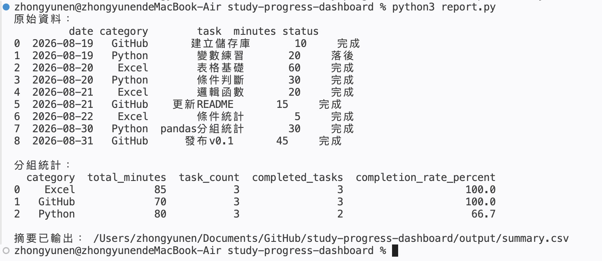

# Study Progress Dashboard

A personal project for recording and analyzing study progress.

## Goals

- Record daily study time
- Analyze progress with Excel
- Generate reports with Python
- Visualize weekly learning results

## Tools

- Microsoft Excel
- Python
- GitHub

## Project Status

Project setup in progress.

# Study Progress Dashboard

使用 Python、CSV 與 pandas 製作的學習進度統計工具。

## 功能

- 讀取 `data/progress.csv`
- 依 Excel、Python、GitHub 分組
- 統計各類別的學習分鐘
- 統計任務數與完成任務數
- 計算完成率
- 輸出 `output/summary.csv`

## 專案結構

```text
data/progress.csv       學習紀錄
output/summary.csv      統計結果
read_csv.py             CSV 基礎讀取程式
report.py               pandas 統計程式
main.py                 Python 基礎練習

## CSV 欄位

`progress.csv` 的第一列必須使用以下欄位名稱：

```csv
date,category,task,minutes,status
```

各欄位的意思：

- `date`：日期，例如 `2026-08-31`
- `category`：學習類別，例如 `Python`
- `task`：完成的任務
- `minutes`：學習分鐘數
- `status`：完成狀態，例如 `完成` 或 `落後`

## 執行成果



## 目前版本

v0.1